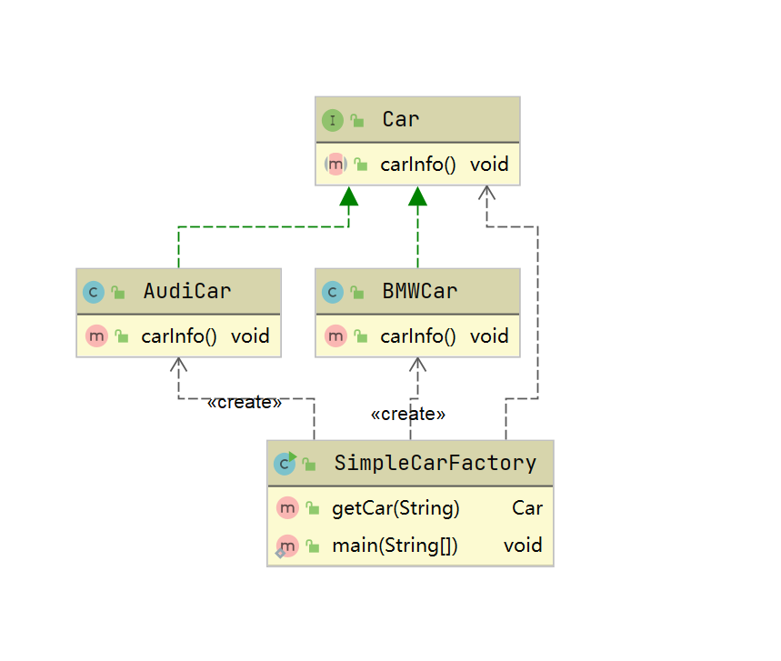
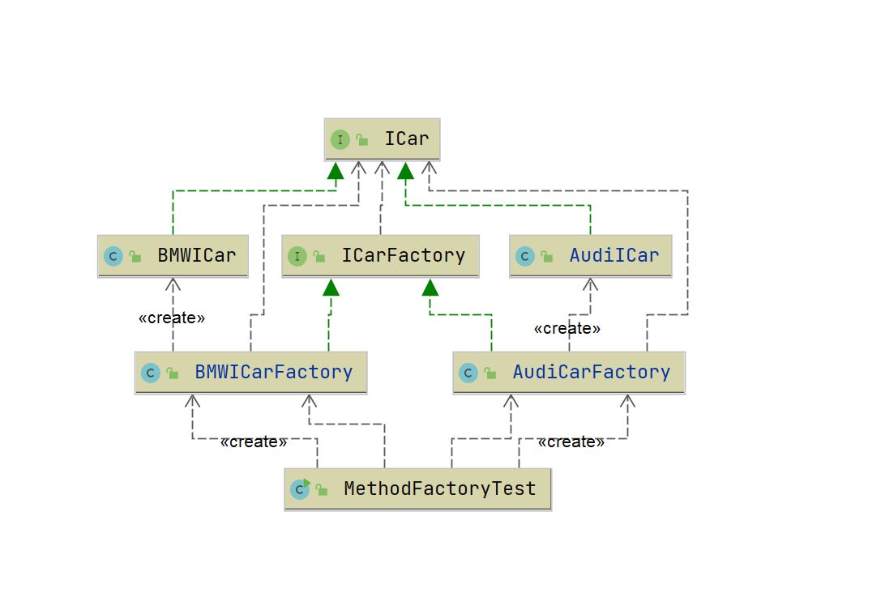
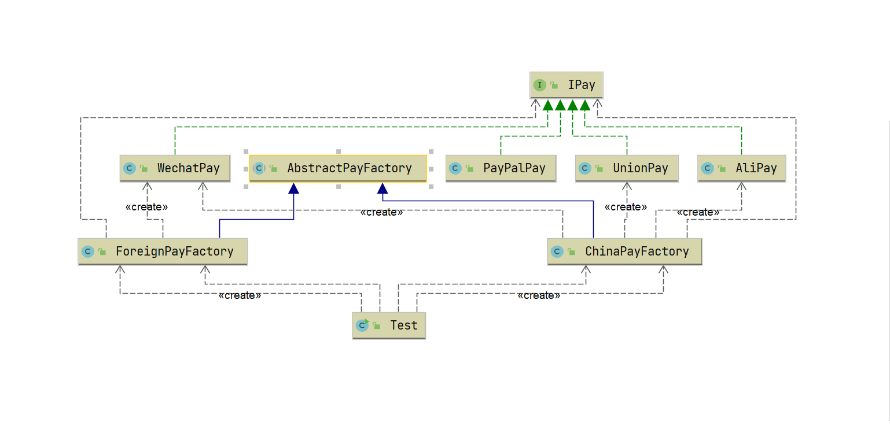
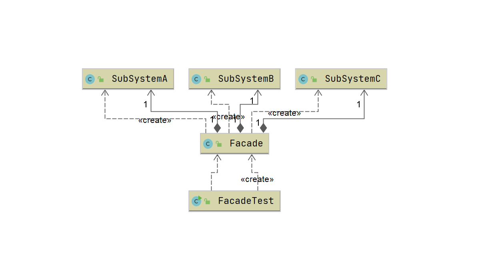

# 设计模式
## 七大软件设计原则
### 开闭原则
    提高对扩展开放，对修改关闭。用抽象构建框架，用实现扩展细节。
    可复用性，可维护性
### 依赖倒置原则
    高层模块不应该依赖底层模块，应该依赖抽象
    减少类之间的耦合性，提高代码可读性和维护性
### 单一职责原则
    一个类、接口、方法、只负责一件事情
    提高代码可读性、系统可维护性，降低修改引起错误的风险
### 接口隔离原则
    用多个专门的接口，而不是使用单一的总接口，客户端不应该依赖他不需要的接口，尽量细化接口
    高内聚，低耦合，提高类的可读性、可维护性、可扩展性
### 迪米特法则
    一个对象对其他对象保持最少理解，又叫最少知道原则
    降低类之间的耦合
### 里氏替换原则
    如果对每一个类型为S的对象o1，都有类型为T的对象o2，使得以T定义的所有程序P在所有的对象o1都代换成o2时，程序P的行为没有发生变化，那么类型S是类型T的子类型
    所有引用基类的地方必须能透明地使用其子类的对象
    里氏替换原则对继承进行了规则上的约束，这种约束主要体现在四个方面： 
    1. 子类必须实现父类的抽象方法，但不得重写（覆盖）父类的非抽象（已实现）方法
    2. 子类中可以增加自己特有的方法
    3. 当子类覆盖或实现父类的方法时，方法的前置条件（即方法的形参）要比父类方法的输入参数更宽松
    4. 当子类的方法实现父类的抽象方法时，方法的后置条件（即方法的返回值）要比父类更严格
    约束继承泛滥，是开闭原则的一种体现
    增加程序健壮性，修改时可以做到非常好的兼容性，提高程序的维护性、扩展性。降低需求变更时引入的风险
### 合成复用原则
    尽量使用对象组合、聚合，而不是继承关系达到软件复用的目的，聚合has-a，组合contains-a
    一个类的变换，对其他类造成的影响相对较少

## 常见设计模式

### 创建型模式

#### 工厂设计模式

​	定义： 一个工厂对象决定创建出那种产品类的实例。
​	优点：创建者只需要传入参数，不需要知道内部是怎么实现的
​	缺点：工厂类职责过重，增加新的产品时需要修改工厂类的判断逻辑，违背了开闭原则，不宜与扩展复杂的产品结构

##### 简单工厂设计模式

​	简单工厂的结构和实现



​	简单实现

```java
package com.hywang.designpatterns.simplefactory;

/**
 * 简单工厂
 */
public class SimpleFactory {

    public static void main(String[] args) {
        SimpleCarFactory simpleCarFactory = new SimpleCarFactory();
        Car audi = simpleCarFactory.getCar("奥迪");
        audi.name();
    }


    public interface Car {
        void carInfo();
    }

    /**
     * 具体产品： 奥迪
     */
    static class AudiCar implements Car {
        public void carInfo() {
            System.out.println("这是一台奥迪汽车");
        }
    }

    /**
     * 具体产品：宝马
     */
    static class BMWCar implements Car {
        public void carInfo() {
            System.out.println("这是一台宝马汽车...");
        }
    }

    /**
     * 生产汽车的简单工厂
     */
    static class SimpleCarFactory{
        /**
         * 根据传入的名称  汽车对象
         * @param name
         * @return
         */
        public Car getCar(String name){
            if("奥迪".equals(name)){
                return new AudiCar();
            }
            if("宝马".equals(name)){
                return new BMWCar();
            }
            return null;
        }
    }
}

```

##### 工厂方法设计模式

​	定义：一个创建对象的接口，让实现这个接口的类决定实例化那个类。
​	优点：用户只需要知道具体工厂的名称就可得到所要的产品，无须知道产品的具体创建过程。灵活性增强，对于新产品的创建，只需多写一个相应的工厂类。典型的解耦框架。高层模块只需要知道产品的抽象类，无须关心其他实现类，满足迪米特法则、依赖倒置原则和里氏替换原则。
​	缺点：类的个数容易过多，增加复杂度。增加了系统的抽象性和理解难度。抽象产品只能生产一种产品，此弊端可使用抽象工厂模式解决。

工厂方法的结构和实现



​	工厂方法代码实现

```java
/**
 * 抽象产品 汽车
 */
public interface ICar {
    void carInfo();
}

/**
 * 具体产品：宝马
 */
public class BMWICar implements ICar {
    @Override
    public void carInfo() {
        System.out.println("这是一台宝马汽车...");
    }
}

/**
 *  具体的产品 奥迪
 */
public class AudiICar implements ICar {
    @Override
    public void carInfo() {
        System.out.println("这是一台奥迪汽车");
    }
}

/**
 * 抽象汽车 工厂
 */
public interface ICarFactory {
    ICar create();
}
/**
 *  宝马的 工厂方法
 */
public class BMWICarFactory implements ICarFactory {

    @Override
    public ICar create() {
        return new BMWICar();
    }
}

/**
 * 奥迪的 工厂方法
 */
public class AudiCarFactory implements ICarFactory {

    @Override
    public ICar create() {
        return new AudiICar();
    }
}
/**
 * 测试
 */
public class MethodFactoryTest {
    public static void main(String[] args) {
        AudiCarFactory audiCarFactory = new AudiCarFactory();
        audiCarFactory.create().carInfo();

        BMWICarFactory bmwiCarFactory = new BMWICarFactory();
        bmwiCarFactory.create().carInfo();
    }
}


```

##### 抽象工厂设计模式

​	定义：是一种为访问类提供一个创建一组相关或相互依赖对象的接口，且访问类无须指定所要产品的具体类就能得到同族的不同等级的产品的模式结构。
​	优点：可以在类的内部对产品族中相关联的多等级产品共同管理，而不必专门引入多个新的类来进行管理。当需要产品族时，抽象工厂可以保证客户端始终只使用同一个产品的产品组。抽象工厂增强了程序的可扩展性，当增加一个新的产品族时，不需要修改原代码，满足开闭原则。
​	缺点：当产品族中需要增加一个新的产品时，所有的工厂类都需要进行修改。增加了系统的抽象性和理解难度。

 用工厂模式设计支付业务场景，包含跨境支付，支付宝、微信、银联支付



```java
/**
 * 定义支付接口
 */
public interface IPay {
    void pay();
}

/**
 * 支付宝实现
 */
public class AliPay implements IPay{
    @Override
    public void pay() {
        System.out.println("使用支付宝支付");
    }
}
/**
 * 微信实现
 */
public class WechatPay implements IPay{
    @Override
    public void pay() {
        System.out.println("使用微信支付");
    }
}
/**
 * 银联支付实现
 */
public class UnionPay implements IPay{
    @Override
    public void pay() {
        System.out.println("使用银联支付");
    }
}
/**
 * PayPal支付实现
 */
public class PayPalPay implements IPay{
    @Override
    public void pay() {
        System.out.println("使用PayPal支付");
    }
}
/**
 * 支付抽象工厂
 */
public abstract class AbstractPayFactory {

    public void init(){
        System.out.println("抽象支付工厂初始化");
    }
}
/**
 * 国内支付 实现工厂
 */
public class ChinaPayFactory extends AbstractPayFactory {

    protected IPay wechatPay() {
        return new WechatPay();
    }

    protected IPay aliPay() {
        return new AliPay();
    }

    protected IPay unionPay() {
        return new UnionPay();
    }
}
/**
 * 国外支付实现  工厂
 */
public class ForeignPayFactory extends AbstractPayFactory {

    protected IPay wechatPay() {
        return new WechatPay();
    }
}
/**
 * 测试
 */
public class Test {
    public static void main(String[] args) {
        ChinaPayFactory chinaPayFactory = new ChinaPayFactory();
        chinaPayFactory.aliPay().pay();
        chinaPayFactory.wechatPay().pay();
        chinaPayFactory.unionPay().pay();
        ForeignPayFactory foreignPayFactory = new ForeignPayFactory();
        foreignPayFactory.wechatPay().pay();
    }
}


```

#### 单例模式

​	定义：一个类在任何情况下只有一个实例，并且提供全局的访问点 。隐藏所有构造方法
​	例子：ServletContext、ServletConfig、ApplicationContext

##### 饿汉式单例

```java
/**
 * 饿汉式单例
 *
 * 优点：执行效率高，性能高，没有加任何锁
 * 缺点：用static修饰，在类加载的时候就会初始化singleton，不管这个类用不用都会占用内存，造成内存浪费
 */
public class HungrySingleton {

    private static HungrySingleton singleton = new HungrySingleton();

    private HungrySingleton() {
    }

    public static HungrySingleton getInstance(){
        return singleton;
    }
}

```

##### 懒汉式单例

```java
/**
 * 懒汉式
 * <p>
 * 优点：在类调用的时候才会创建singleton,节省内存
 * 缺点：多线程情况下，不安全
 *
 */

public class LazySingleton {

    private static LazySingleton singleton = null;

    private LazySingleton() {
    }

    private static LazySingleton getInstance() {
        if (null == singleton) {
            singleton = new LazySingleton();
        }
        return singleton;
    }
}

```

##### 双重校验锁

```java
/**
 * 双重校验锁
 * 优点：解决懒汉式单例线程不安全
 * 缺点：程序可读性差
 */
public class DoubleCheckSingleton {
    //volatile 解决指令重排问题
    private static volatile DoubleCheckSingleton singleton = null;

    private DoubleCheckSingleton() {
    }

    public static DoubleCheckSingleton getInstance() {
        if (null == singleton) {
            synchronized (DoubleCheckSingleton.class) {
                if (null == singleton) {
                    singleton = new DoubleCheckSingleton();
                }
            }
        }
        return singleton;
    }
}

```

##### 静态内部类

```java
/**
 * 静态内部类
 * 优点: 利用Java本身语法特性，写法优雅
 * 缺点：能被反射破坏 （在构造方法增加判断可以解决）
 */
public class LazyInnerClassSingleton {
    private LazyInnerClassSingleton() {
        // 确保反射不会破坏单例
        if (null != SingletonHolder.singleton) {
            throw new RuntimeException("单例不允许访问构造方法");
        }
    }

    private static LazyInnerClassSingleton getInstance() {
        return SingletonHolder.singleton;
    }

    public static class SingletonHolder {
        private static LazyInnerClassSingleton singleton = new LazyInnerClassSingleton();
    }


    /**
     * 反射破坏单例
     */
    public static void main(String[] args) throws NoSuchMethodException, IllegalAccessException, InvocationTargetException, InstantiationException {
        Class<?> clazz = LazyInnerClassSingleton.class;
        //获取到LazyInnerClassSingleton无参构造方法
        Constructor<?> constructor = clazz.getDeclaredConstructor(null);
        //强制访问  构造方法private
        constructor.setAccessible(true);
        //创建实例
        Object instance = constructor.newInstance();
        Object instance1 = constructor.newInstance();
        System.out.println(instance1 == instance);
    }

}
```

##### 枚举式单例

```java
/**
 * 枚举式单例 (注册式单例)
 * 缺点：不能大批量创建对象 （container式单例可以解决）
 */
public enum EnumSingleton {
    INSTANCE;

    private String value;

    public String getValue() {
        return value;
    }

    public void setValue(String value) {
        this.value = value;
    }

    public static EnumSingleton getInstance() {
        return INSTANCE;
    }

    public static void main(String[] args) throws NoSuchMethodException, IllegalAccessException, InvocationTargetException, InstantiationException {
        EnumSingleton instance = EnumSingleton.getInstance();
        instance.setValue("value");

        // 反射不能破坏枚举式单例
        Class<?> clazz = EnumSingleton.class;
        //Constructor<?> constructor = clazz.getDeclaredConstructor(null);
        Constructor<?> constructor = clazz.getDeclaredConstructor(String.class,int.class);
        constructor.setAccessible(false);
        Object obj = constructor.newInstance();
        System.out.println(obj);
        //
        /**
         * Exception in thread "main" java.lang.NoSuchMethodException: com.hywang.designpatterns.singleton.EnumSingleton.<init>()
         * 	at java.lang.Class.getConstructor0(Class.java:3082)
         * 	at java.lang.Class.getDeclaredConstructor(Class.java:2178)
         * 	at com.hywang.designpatterns.singleton.EnumSingleton.main(EnumSingleton.java:32)
         */
        //枚举有一个父类 Enum.java 构造方法有两个参数，
        //修改为两个参数的构造方法      Constructor<?> constructor = clazz.getDeclaredConstructor(String.class,int.class);
        /**
         * Exception in thread "main" java.lang.IllegalArgumentException: Cannot reflectively create enum objects
         * 	at java.lang.reflect.Constructor.newInstance(Constructor.java:417)
         * 	at com.hywang.designpatterns.singleton.EnumSingleton.main(EnumSingleton.java:35)
         */

    }
}

```

##### 注册式单例

```java
/**
 * 容器式单例
 * 优点：可以大批量创建对象
 * 缺点：
 */
public class ContainerSingleton {
    private static Map<String, Object> container = new ConcurrentHashMap<>();

    private ContainerSingleton() {
    }

    public static Object getInstance(String className) {
        Object instance = null;
        if (!container.containsKey(className)) {
            try {
                instance = Class.forName(className).newInstance();
                container.put(className, instance);
            } catch (InstantiationException e) {
                e.printStackTrace();
            } catch (IllegalAccessException e) {
                e.printStackTrace();
            } catch (ClassNotFoundException e) {
                e.printStackTrace();
            }

        } else {
            instance = container.get(className);
        }
        return instance;
    }
}

```

##### ThreadLocal式单例

```java
/**
 * 保证线程内部的全局唯一，线程安全
 * 局限性：只能保证线程内单例
 *
 */
public class ThreadLocalSingleton {
    private static final ThreadLocal<ThreadLocalSingleton> threadLocalInstance = new ThreadLocal<ThreadLocalSingleton>() {
        @Override
        protected ThreadLocalSingleton initialValue() {
            return new ThreadLocalSingleton();
        }
    };

    private ThreadLocalSingleton() {
    }

    public static ThreadLocalSingleton getInstance() {
        return threadLocalInstance.get();
    }


    public static void main(String[] args) {
        System.out.println("第一次获取单例对象："+ThreadLocalSingleton.getInstance());
        System.out.println("第二次获取单例对象："+ThreadLocalSingleton.getInstance());
        System.out.println("第三次获取单例对象："+ThreadLocalSingleton.getInstance());

        Thread thread1 = new Thread(new TestThread());
        Thread thread2 = new Thread(new TestThread());
        thread1.start();
        thread2.start();
    }

}


class  TestThread implements Runnable{
    @Override
    public void run() {
        ThreadLocalSingleton singleton = ThreadLocalSingleton.getInstance();
        System.out.println(Thread.currentThread().getName() + singleton);
    }
}

```

##### 序列化破坏单例

```java
/**
 * 序列化 可能会破坏单例
 */
public class SerializableSingleton implements Serializable {
    //序列化就是说把内存中的状态通过转换成字节码的形式
    //从而转换一个IO流，写入到其他地方(可以是磁盘、网络IO)
    //内存中状态给永久保存下来了

    //反序列化
    //讲已经持久化的字节码内容，转换为IO流
    //通过IO流的读取，进而将读取的内容转换为Java对象
    //在转换过程中会重新创建对象new
    public final static SerializableSingleton singleton = new SerializableSingleton();

    private SerializableSingleton() {
    }

    public static SerializableSingleton getInstance() {
        return singleton;
    }

    private Object readResolve() {
        return singleton;
    }

    /**
     * 演示 序列化破坏 单例
     *
     * @param args
     * @throws IOException
     * @throws ClassNotFoundException
     */
    public static void main(String[] args) throws IOException, ClassNotFoundException {
        //获取到单例对象
        SerializableSingleton instance = SerializableSingleton.getInstance();

        //序列化
        FileOutputStream fileOutputStream = new FileOutputStream("temp");
        ObjectOutputStream objectOutputStream = new ObjectOutputStream(fileOutputStream);
        objectOutputStream.writeObject(instance);

        //反序列化
        FileInputStream fileInputStream = new FileInputStream("temp");
        ObjectInputStream objectInputStream = new ObjectInputStream(fileInputStream);
        SerializableSingleton o = (SerializableSingleton) objectInputStream.readObject();

        // 解决 序列化会破坏单例问题
        /*   public Object readResolve(){
             return singleton;
        } */
        //验证结果
        System.out.println(instance == o);
    } 
}

```

#### 原型模式

​	定义：用一个已经创建的实例作为原型，通过复制该原型对象来创建一个和原型相同或相似的新对象。原型实例指定了要创建的对象的种类
用这种方式创建对象非常高效，根本无须知道对象创建的细节。
​	适用场景：

	1. 类初始化占用资源较多
	2. new禅城回想需要非常复杂的过程
	3. 构造方法比较复杂
	4. 循环体中产生大量对象 

​	优点：Java 自带的原型模式基于内存二进制流的复制，在性能上比直接 new 一个对象更加优良。以使用深克隆方式保存对象的状态，使用原型模式将对象复制一份，并将其状态保存起来，简化了创建对象的过程，以便在需要的时候使用（例如恢复到历史某一状态），可辅助实现撤销操作。
​	缺点：需要为每一个类都配置一个 clone 方法 clone 方法位于类的内部，当对已有类进行改造的时候，需要修改代码，违背了开闭原则。当实现深克隆时，需要编写较为复杂的代码，而且当对象之间存在多重嵌套引用时，为了实现深克隆，每一层对象对应的类都必须支持深克隆，实现起来会比较麻烦。因此，深克隆、浅克隆需要运用得当。

##### 浅克隆

​	创建一个新对象，新对象的属性和原来对象完全相同，对于非基本类型属性，仍指向原有属性所指向的对象的内存地址。

##### 深克隆

​	创建一个新对象，属性中引用的其他对象也会被克隆，不再指向原有对象地址。

```java
public class SampleModel implements Cloneable, Serializable {
    private String attribute1;
    private String attribute2;
    private List<String> attribute3;

    public SampleModel() {
    }

    public String getAttribute1() {
        return attribute1;
    }

    public void setAttribute1(String attribute1) {
        this.attribute1 = attribute1;
    }

    public String getAttribute2() {
        return attribute2;
    }

    public void setAttribute2(String attribute2) {
        this.attribute2 = attribute2;
    }

    public List<String> getAttribute3() {
        return attribute3;
    }

    public void setAttribute3(List<String> attribute3) {
        this.attribute3 = attribute3;
    }

    /**
     * 浅克隆
     *
     * @return
     * @throws CloneNotSupportedException
     */
    @Override
    protected SampleModel clone() throws CloneNotSupportedException {
        return (SampleModel)super.clone();
    }

    /**
     * 深克隆
     *
     * @return
     */
    protected SampleModel deepClone() throws IOException, ClassNotFoundException {
        ByteArrayOutputStream bos = new ByteArrayOutputStream();
        ObjectOutputStream oos = new ObjectOutputStream(bos);
        oos.writeObject(this);
        ByteArrayInputStream bis = new ByteArrayInputStream(bos.toByteArray());
        ObjectInputStream ois = new ObjectInputStream(bis);
        return (SampleModel) ois.readObject();
    }

    @Override
    public String toString() {
        return "SampleModel{" +
                "attribute1='" + attribute1 + '\'' +
                ", attribute2='" + attribute2 + '\'' +
                ", attribute3=" + attribute3 +
                '}';
    }
}


/**
 * 原型 测试
 */
public class PrototypeTest {
    public static void main(String[] args) throws CloneNotSupportedException, IOException, ClassNotFoundException {
        SampleModel model = new SampleModel();
        model.setAttribute1("a1");
        model.setAttribute2("a2");

        SampleModel cloneModel =  model.clone();

        System.out.println(model == cloneModel);
        System.out.println("原对象：" + model);
        System.out.println("克隆对象：" + cloneModel);

        // 浅克隆只能克隆基本类型数据


        SampleModel model1 = new SampleModel();
        model1.setAttribute1("a1");
        model1.setAttribute2("a2");
        List<String> list = new ArrayList<>();
        list.add("a3");
        model1.setAttribute3(list);
        SampleModel cloneModel1 =  model1.deepClone();

        System.out.println(model1 == cloneModel1);
        System.out.println("原对象：" + model1);
        System.out.println("克隆对象：" + cloneModel1);


    }
}

```


#### 建造者模式

​	定义：指将一个复杂对象的构造与它的表示分离，使同样的构建过程可以创建不同的表示，这样的[设计模式](http://c.biancheng.net/design_pattern/)被称为建造者模式。它是将一个复杂的对象分解为多个简单的对象，然后一步一步构建而成。它将变与不变相分离，即产品的组成部分是不变的，但每一部分是可以灵活选择的

​	适用场景

1. 适用于创建对象需要很多步骤，但是步骤的顺序不固定
2. 如果一个对象很多的属性
3. 把复杂对象的创建和使用分离


​	优点：封装性好，创建和使用分离

​	缺点：扩展性好，建造类之间独立，一定程度上解耦

```java
/**
 * 客厅 对象
 */
public class Parlour {
    //电视
    private String television;
    //沙发
    private String sofa;
    //桌子
    private String table;
    //墙
    private String wall;

    public Parlour() {
    }

    public String getTelevision() {
        return television;
    }

    public void setTelevision(String television) {
        this.television = television;
    }

    public String getSofa() {
        return sofa;
    }

    public void setSofa(String sofa) {
        this.sofa = sofa;
    }

    public String getTable() {
        return table;
    }

    public void setTable(String table) {
        this.table = table;
    }

    public String getWall() {
        return wall;
    }

    public void setWall(String wall) {
        this.wall = wall;
    }

    @Override
    public String toString() {
        return "Parlour{" +
                "television='" + television + '\'' +
                ", sofa='" + sofa + '\'' +
                ", table='" + table + '\'' +
                ", wall='" + wall + '\'' +
                '}';
    }
}


/**
 * 抽象装修工人
 */
public abstract class Decorator {
    //创建产品对象
    protected Parlour product = new Parlour();

    public abstract void buildTelevisionl();

    public abstract void buildSofa();

    public abstract void buildTable();

    public abstract void buildWall();

    /**
     * 返回产品对象
     *
     * @return
     */
    public Parlour getResult() {
        return product;
    }
}


/**
 * 具体建造者：具体装修工人ONE
 */
public class ConcreteDecoratorOne extends Decorator{

    @Override
    public void buildTelevisionl() {
        this.product.setTelevision("ones television");
    }

    @Override
    public void buildSofa() {
        this.product.setSofa("ones Sofa");
    }

    @Override
    public void buildTable() {
        this.product.setTable("ones table");
    }
    @Override
    public void buildWall() {
        this.product.setWall("ones wall");
    }
}
/**
 * 具体建造者：TWO
 */
public class ConcreteDecoratorTwo extends Decorator{

    @Override
    public void buildTelevisionl() {
        this.product.setTelevision("twos television");
    }

    @Override
    public void buildSofa() {
        this.product.setSofa("twos Sofa");
    }

    @Override
    public void buildTable() {
        this.product.setTable("twos table");
    }
    @Override
    public void buildWall() {
        this.product.setWall("twos wall");
    }
}
 

public class BuilderTest {
    public static void main(String[] args) {
        Decorator decorator = new ConcreteDecoratorOne();
        decorator.buildSofa();
        decorator.buildWall();
        decorator.buildTelevisionl();
        Parlour result = decorator.getResult();
        result.show();

        Decorator decorator2 = new ConcreteDecoratorTwo();
        decorator2.buildTable();
        decorator2.buildTelevisionl();
        Parlour result2 = decorator2.getResult();
        result2.show();
    }
}


```

##### 建造者模式和工厂模式区别

1. 建造者模式更加注重方法调用的顺序，工厂模式注重对象的创建
2. 创建对象的力度不同，建造者模式创建复杂的对象，由各种复杂的部件组成，工厂模式创建的对象都一样
3. 关注点不同，工厂木事只需要把对象创建出来就可以，建造者模式不仅要创建出对象，还要知道对象的组成部件
4. 建造者模式根据建造过程中的顺序不一样最终的对象部件组成也不一样

### 结构型

#### 代理模式

​	定义：由于某些原因需要给某对象提供一个代理以控制对该对象的访问。这时，访问对象不适合或者不能直接引用目标对象，代理对象作为访问对象和目标对象之间的中介

​	优点

- 代理模式在客户端与目标对象之间起到一个中介作用和保护目标对象的作用
- 代理对象可以扩展目标对象的功能
- 代理模式能将客户端与目标对象分离，在一定程度上降低了系统的耦合度，增加了程序的可扩展性


​	缺点

- 代理模式会造成系统设计中类的数量增加
- 在客户端和目标对象之间增加一个代理对象，会造成请求处理速度变慢
- 增加了系统的复杂度

##### 静态代理 

以张三找对象为例，实现一个静态代理

```java
/**
 * 抽象接口
 */
public interface IPerson {
    /**
     * 找对象
     */
    void findLove();
}

/**
 * 被代理对象
 */
public class Zhangsan implements IPerson {

    @Override
    public void findLove() {
        System.out.println("张三想找对象，白富美");
    }
}
/**
 * 代理对象
 */
public class ZhangsansFather implements IPerson {
    private IPerson person;

    public ZhangsansFather(IPerson person) {
        this.person = person;
    }

    @Override
    public void findLove() {
        System.out.println("张三的老爸，帮张三张罗对象");
        person.findLove();
        System.out.println("找到对象开始交往");
    }
}
/**
 * 静态代理测试
 */
public class Test {
    public static void main(String[] args) {
        ZhangsansFather father = new ZhangsansFather(new Zhangsan());
        father.findLove();
    }
}
```

##### 动态代理

###### JDK动态代理

​	JDK动态代理必须要要实现接口，为什么不适用继承？因为Java不支持多继承，在代理类中要继承Proxy类，所以只能使用实现接口的方式。

​	下面以李四王五，媒婆代理找对象的JDK动态代理实现

```java
/**
 * 被代理对象
 */
public class Lisi implements IPerson {
    @Override
    public void findLove() {
        System.out.println("李四想找对象，温柔");
    }
}

/**
 * 被代理对象
 */
public class Wangwu implements IPerson {
    @Override
    public void findLove() {
        System.out.println("王五想找对象，贤惠");
    }
}

/**
 * 媒婆动态代理类
 */
public class JDKMeiPo implements InvocationHandler {

    private IPerson target;

    public IPerson getTarget(IPerson target) {
        this.target = target;
        Class<? extends IPerson> clazz = target.getClass();
        return (IPerson) Proxy.newProxyInstance(clazz.getClassLoader(),clazz.getInterfaces(),this);
    }

    @Override
    public Object invoke(Object proxy, Method method, Object[] args) throws Throwable {
        before();
        Object invoke = method.invoke(target, args);
        after();
        return invoke;
    }

    private void after() {
        System.out.println("双方看对眼，开始交往");
    }

    private void before() {
        System.out.println("媒婆已经收集到需求，开始帮忙找对象");
    }
}


/**
 * JDK动态代理测试
 */
public class JDKProxyTest {
    public static void main(String[] args) {
        JDKMeiPo jdkMeiPo = new JDKMeiPo();
        IPerson zhangsan = jdkMeiPo.getTarget(new Zhangsan());
        zhangsan.findLove();

        IPerson wangwu = jdkMeiPo.getTarget(new Wangwu());
        wangwu.findLove();
    }
}

```

###### CGLIB动态代理

​	CGLIB动态代理实现的类不能被final修饰

​	下面以李四，媒婆代理找对象的CGLIB动态代理实现

```java

/**
 * cglib实现动态代理
 */
public class CglibMeiPo implements MethodInterceptor {

    public Object getTarget(Class<?> clazz) {
       Enhancer enhancer = new Enhancer();
       enhancer.setSuperclass(clazz);
       enhancer.setCallback(this);
       return enhancer.create();
    }


    private void after() {
        System.out.println("双方看对眼，开始交往");
    }

    private void before() {
        System.out.println("媒婆已经收集到需求，开始帮忙找对象");
    }
    @Override
    public Object intercept(Object o, Method method, Object[] objects, MethodProxy methodProxy) throws Throwable {
       before();
        Object obj = methodProxy.invokeSuper(o, objects);
        after();
        return obj;
    }
}

/**
 * cglib实现动态代理
 */
public class CglibTest {
    public static void main(String[] args) {
        CglibMeiPo cglibMeiPo = new CglibMeiPo();
        Lisi lisi = (Lisi)cglibMeiPo.getTarget(Lisi.class);
        lisi.findLove();
    }
}


```

#### 适配器模式

​	定义：在不改变现有对象结构的情况下，动态的给对象增加一些职责。

​	优点：提高类的透明性和复用性，现有的类服用但不需要改变。目标类和适配器解耦，提高程序扩展性。符合开闭原则。

​	缺点：装饰器模式会增加许多子类，过度使用会增加程序得复杂性

##### 类适配器

​	类适配器是通过继承来实现适配功能

```java

/**
 * 220 电压
 */
public class AC220 {
    /**
     * 输出220电压
     * @return
     */
    public int outputAC220V(){
        int output = 220;
        System.out.println("输出电压" + output + "V");
        return output;
    }
}
/**
 * 5v 接口
 */
public interface DC5 {
    int output5V();
}
/**
 * 电压适配器
 */
public class PowerAdapter extends AC220 implements DC5 {
    public int output5V() {
        int adapterInput = super.outputAC220V();
        int adapterOutput = adapterInput / 44;
        System.out.println("使用Adapter输入AC" + adapterInput + "V,输出DC" + adapterOutput + "V");
        return adapterOutput;
    }
}
/**
 * 测试
 */
public class Test {
    public static void main(String[] args) {
        DC5 adapter = new PowerAdapter();
        adapter.output5V();
    }
}

```

##### 接口适配器

​	通过实现接口

```java
/**
 * 220 电压
 */
public class AC220 {
    /**
     * 输出220电压
     * @return
     */
    public int outputAC220V(){
        int output = 220;
        System.out.println("输出电压" + output + "V");
        return output;
    }
}
/**
 * 获取其他电压接口
 */
public interface DC {
    int output5V();
    int output12V();
    int output24V();
    int output36V();
}

/**
 * 电压适配器
 */
public class PowerAdapter implements DC {
    private AC220 ac220;

    public PowerAdapter(AC220 ac220) {
        this.ac220 = ac220;
    }

    public int output5V() {
        int adapterInput = ac220.outputAC220V();
        int adapterOutput = adapterInput / 44;
        System.out.println("使用Adapter输入AC" + adapterInput + "V,输出DC" + adapterOutput + "V");
        return adapterOutput;
    }

    public int output12V() {
        return 12;
    }

    public int output24V() {
        return 24;
    }

    public int output36V() {
        return 36;
    }
}
/**
 * 测试
 */
public class Test {
    public static void main(String[] args) {
        DC adapter = new PowerAdapter(new AC220());
        adapter.output5V();
    }
}

```

##### 对象适配器

​	对象适配器是通过组合来实现适配器功能的，即适配器拥有源角色的实例

```java
/**
 * 220 电压
 */
public class AC220 {
    /**
     * 输出220电压
     * @return
     */
    public int outputAC220V(){
        int output = 220;
        System.out.println("输出电压" + output + "V");
        return output;
    }
}
public interface DC5 {
    int output5V();
}
/**
 * 电压适配器
 */
public class PowerAdapter implements DC5 {
    private AC220 ac220;

    public PowerAdapter(AC220 ac220) {
        this.ac220 = ac220;
    }

    public int output5V() {
        int adapterInput = ac220.outputAC220V();
        int adapterOutput = adapterInput / 44;
        System.out.println("使用Adapter输入AC" + adapterInput + "V,输出DC" + adapterOutput + "V");
        return adapterOutput;
    }
}
/**
 * 测试
 */
public class Test {
    public static void main(String[] args) {
        DC5 adapter = new PowerAdapter(new AC220());
        adapter.output5V();
    }
}

```

#### 桥接模式

​	定义：将抽象和实现分离，使他们可以独立。使用组合关系替代继承降低抽象和实现可变性的耦合度

​	优点：抽象与实现分离，扩展能力强，符合开闭原则、合成服用原则

​	缺点：针对抽象化进行设计编程增加系统设计和理解难度

```java
//模式模拟女士皮包的选购
/**
 * 颜色接口
 */
public interface Color {

    String colorName();
}

/**
 * 绿色
 */
public class GreenColor implements Color{
    @Override
    public String colorName() {
        return "绿色";
    }
}

/**
 * 红色
 */
public class RedColor implements Color{
    @Override
    public String colorName() {
        return "红色";
    }
}
/**
 * 抽象 包  背包
 */
public abstract class Bag {
    protected Color color;
    // 用途 由子类实现
    public abstract String getName();

    public void setColor(Color color) {
        this.color = color;
    }
}
/**
 * 背包
 */
public class BackpackBag extends Bag{

    @Override
    public String getName() {
        return  color.colorName() +"背包";
    }
}
/**
 * 钱包
 */
public class WalletBag extends Bag{
    @Override
    public String getName() {
        return color.colorName()+ "钱包";
    }
}
/**
 * 测试
 */
public class ClientTest {

    public static void main(String[] args) {

        Color redColor = new RedColor();
        Color greenColor = new GreenColor();

        Bag bag = new WalletBag();
        bag.setColor(redColor);
        String name = bag.getName();
        System.out.println(name);
    }

}


```

#### 装饰器模式

​	装饰器模式又叫包装模式

​	定义：在不改变原有对象的基础上，给对象增加功能，扩展原有对象的功能

​	优点：遵循开闭原则

​	缺点：代码类增多

```java
//饼夹菜
/**
 * 饼夹菜
 */
public abstract class CakeWithVegetables {

    public abstract String cakeName();
    public abstract int cakePrice();
}
/**
 * 饼夹菜 基础套餐
 */
public  class BaseCakeWithVegetables extends  CakeWithVegetables{

    @Override
    public String cakeName() {
        return "饼夹菜基础套餐";
    }

    @Override
    public int cakePrice() {
        return 5;
    }
}
/**
 * 饼夹菜装饰器
 */
public class CakeWithVegetablesDecorator extends CakeWithVegetables{
    private CakeWithVegetables cakeWithVegetables;

    public CakeWithVegetablesDecorator(CakeWithVegetables cakeWithVegetables) {
        this.cakeWithVegetables = cakeWithVegetables;
    }

    @Override
    public String cakeName() {
        return cakeWithVegetables.cakeName();
    }

    @Override
    public int cakePrice() {
        return cakeWithVegetables.cakePrice();
    }
}/**
 * 加鸡蛋装饰器
 */
public class AddAggDecorator extends CakeWithVegetablesDecorator{

    public AddAggDecorator(CakeWithVegetables cakeWithVegetables) {
        super(cakeWithVegetables);
    }
    @Override
    public String cakeName() {
        return super.cakeName() + "加一个鸡蛋";
    }

    @Override
    public int cakePrice() {
        return super.cakePrice()+ 2;
    }
}
/**
 * 加香肠装饰器
 */
public class AddSausageDecorator extends CakeWithVegetablesDecorator{

    public AddSausageDecorator(CakeWithVegetables cakeWithVegetables) {
        super(cakeWithVegetables);
    }
    @Override
    public String cakeName() {
        return super.cakeName() + "加一个香肠";
    }

    @Override
    public int cakePrice() {
        return super.cakePrice()+ 2;
    }
}
/**
 * 测试
 */
public class Test {
    public static void main(String[] args) {
        CakeWithVegetables cakeWithVegetables;
        cakeWithVegetables = new BaseCakeWithVegetables();
        System.out.println(cakeWithVegetables.cakeName()+"价格是："+cakeWithVegetables.cakePrice());
        cakeWithVegetables = new AddAggDecorator(cakeWithVegetables);
        System.out.println(cakeWithVegetables.cakeName()+"价格是："+cakeWithVegetables.cakePrice());
        cakeWithVegetables = new AddAggDecorator(cakeWithVegetables);
        System.out.println(cakeWithVegetables.cakeName()+"价格是："+cakeWithVegetables.cakePrice());
        cakeWithVegetables = new AddAggDecorator(cakeWithVegetables);
        System.out.println(cakeWithVegetables.cakeName()+"价格是："+cakeWithVegetables.cakePrice());
    }
}

```


#### 门面模式

​	门面模式又叫外观模式。

​	定义：通过为多个复杂的子系统提供一个一致的接口，而使这些子系统更加容易被访问的模式。该模式对外有一个统一接口，外部应用程序不用关心内部子系统的具体细节，这样会大大降低应用程序的复杂度，提高了程序的可维护性。

​	优点：简化调用过程，无须深入了解子系统。减少系统依赖，更好的划分访问层次，提高安全性。遵循迪米特法则

​	缺点：增加子系统和扩展子系统行为时，可能带来位置风险。不符合开闭原则。某些情况可能会违背单一职责原则

```java
/**
 * 子系统A
 */
public class SubSystemA {
    public void doA(){
        System.out.println("子系统A的doA方法被调用");
    } 
}
/**
 * 子系统B
 */
public class SubSystemB {
    public void doB(){
        System.out.println("子系统B的doB方法被调用");
    }
}
/**
 * 子系统C
 */
public class SubSystemC {
    public void doC(){
        System.out.println("子系统C的doC方法被调用");
    }
}

/**
 * 门面类，对外提供子系统的 操作方法
 */
public class Facade {
    private SubSystemA systemA = new SubSystemA();
    private SubSystemB systemB = new SubSystemB();
    private SubSystemC systemC = new SubSystemC();

    public void doAll() {
        systemA.doA();
        systemB.doB();
        systemC.doC();
    }
}
/**
 * 门面模式测试
 */
public class FacadeTest {
    public static void main(String[] args) {
        Facade facade = new Facade();
        facade.doAll();
    }
}


```

​	类图



#### 享元模式

​	定义：运用共享技术来有效地支持大量细粒度对象的复用。它通过共享已经存在的对象来大幅度减少需要创建的对象数量、避免大量相似类的开销，从而提高系统资源的利用率

​	内部状态：内部状态指对象共享出来的信息，存储在享元信息内部，并且不回随环境的改变而改变

​	外部状态：外部状态指对象得以依赖的一个标记，随环境的改变而改变，不可共享

​	优点：相同对象只要保存一份，这降低了系统中对象的数量，从而降低了系统中细粒度对象给内存带来的压力

​	缺点：为了使对象可以共享，需要将一些不能共享的状态外部化，这将增加程序的复杂性。读取享元模式的外部状态会使得运行时间稍微变长

​	下面是以车票信息为例

```java
/**
 * 车票接口
 */
public interface ITicket {

    void ticketInfo(String type);
}

/**
 * 具体车票的实现
 */
public class BusTicket implements ITicket {

    //起始站
    private String from;
    //终点站
    private String to;
    //价格
    private int price;

    public BusTicket(String from, String to) {
        this.from = from;
        this.to = to;
    }


    @Override
    public void ticketInfo(String type) {
        this.price = new Random().nextInt(100);
        System.out.println(String.format("汽车起始站为：%s,终点站：%s，车票类型：%s，价格为：%s", from, to, type, price));
    }
}
/**
 * 车票的工厂
 */
public class TicketFactory {
    private static Map<String, BusTicket> pool = new ConcurrentHashMap<>();


    public static BusTicket getTicket(String from, String to) {
        String key = from + "->" + to;
        if (pool.containsKey(key)) {
            System.out.println("使用缓存");
            return pool.get(key);
        }
        System.out.println("创建对象");
        BusTicket busTicket = new BusTicket(from, to);
        pool.put(key, busTicket);
        return busTicket;
    }

    /**
     * 测试
     *
     * @param args
     */
    public static void main(String[] args) {
        TicketFactory ticketFactory = new TicketFactory();
        BusTicket ticket = ticketFactory.getTicket("上海", "杭州");
        ticket.ticketInfo("坐票");
        ticket = ticketFactory.getTicket("上海", "杭州");
        ticket.ticketInfo("卧铺");

        ticket = ticketFactory.getTicket("上海", "北京");
        ticket.ticketInfo("卧铺");
    }
}
```

​	简单的数据库连接池实现

```java
/**
 * 数据库连接池简单实现
 */
public class ConnectionPool {

    private Vector<Connection> pool;

    private String url = "jdbc:mysql://localhost:3306/test";
    private String username = "root";
    private String password = "root";
    private String driverClassName = "com.mysql.jdbc.Driver";
    private int poolSize = 100;

    public ConnectionPool() {
        pool = new Vector<Connection>(poolSize);

        try{
            Class.forName(driverClassName);
            for (int i = 0; i < poolSize; i++) {
                Connection conn = DriverManager.getConnection(url,username,password);
                pool.add(conn);
            }
        }catch (Exception e){
            e.printStackTrace();
        }

    }

    public synchronized Connection getConnection(){
        if(pool.size() > 0){
            Connection conn = pool.get(0);
            pool.remove(conn);
            return conn;
        }
        return null;
    }

    public synchronized void release(Connection conn){
        pool.add(conn);
    }
}
```


#### 组合模式

​	又叫整体-部分模式	

​	定义：它是一种将对象组合成树状的层次结构的模式，用来表示“整体-部分”的关系，使用户对单个对象和组合对象具有一致的访问性

​	优点：清楚的定义分层次的复杂对象，表示对象的全部或部分层次。让客户端忽略了层次的差异，方便对整个层次结构进行控制。简化客户端代码。符合开闭原则

​	缺点：限制类型时会比较复杂，使设计变得更加抽象


### 行为型

#### 模板方法模式

​	定义：又叫模板模式，是指顶一个算法骨架，并允许子类为其中一个或者多个步骤提供实现。

​	优点:

​		1.利用模板方法将相同处理逻辑的代码放到抽象父类中，可以提高代码复用性。

​		2.将不同的代码在子类中实现，通过子类的扩展增加新行为，提高代码扩展性。

​		3.把不变的行为写在父类，去除子类的重复代码，提供了一个很好的代码复用平台，符合开闭原则

​	缺点：

​		1.类数目的增加，每一个抽象类都需要一个子类实现，导致类个数增加。增加了系统实现的复杂度

​		2.集成关系自身的缺点，如果父类添加新的抽象方法，所有子类都要修改

​	源码中实现：JDBCTemplat，

​	模拟一下ORM

```java
/**
 * ROM接口
 */
public interface RowMapper<T> {
    T mapRow(ResultSet rs,int rowNum) throws Exception;
}


/**
 *  JDBC封装操作
 */
public abstract class JdbcTemplate {
    private DataSource dataSource;

    public JdbcTemplate(DataSource dataSource) {
        this.dataSource = dataSource;
    }

    public final List<?> executeQuery(String sql,RowMapper<?> rowMapper,Object[] values){
        try {
            //1、获取连接
            Connection conn = this.getConnection();
            //2、创建语句集
            PreparedStatement pstm = this.createPrepareStatement(conn,sql);
            //3、执行语句集
            ResultSet rs = this.executeQuery(pstm,values);
            //4、处理结果集
            List<?> result = this.parseResultSet(rs,rowMapper);
            //5、关闭结果集
            rs.close();
            //6、关闭语句集
            pstm.close();
            //7、关闭连接
            conn.close();
            return result;
        }catch (Exception e){
            e.printStackTrace();
        }
        return null;
    }

    private List<?> parseResultSet(ResultSet rs, RowMapper<?> rowMapper) throws Exception {
        List<Object> result = new ArrayList<Object>();
        int rowNum = 0;
        while (rs.next()){
            result.add(rowMapper.mapRow(rs,rowNum++));
        }
        return result;
    }


    private ResultSet executeQuery(PreparedStatement pstm, Object[] values) throws SQLException {
        for (int i = 0; i < values.length; i++) {
            pstm.setObject(i,values[i]);
        }
        return pstm.executeQuery();
    }

    private PreparedStatement createPrepareStatement(Connection conn, String sql) throws SQLException {
        return conn.prepareStatement(sql);
    }

    private Connection getConnection() throws SQLException {
        return this.dataSource.getConnection();
    }
}
/**
 *  实体类
 */
public class Member {

    private String username;
    private String password;
    private String nickname;
    private int age;
    private String addr;

    public String getUsername() {
        return username;
    }

    public void setUsername(String username) {
        this.username = username;
    }

    public String getPassword() {
        return password;
    }

    public void setPassword(String password) {
        this.password = password;
    }

    public String getNickname() {
        return nickname;
    }

    public void setNickname(String nickname) {
        this.nickname = nickname;
    }

    public int getAge() {
        return age;
    }

    public void setAge(int age) {
        this.age = age;
    }

    public String getAddr() {
        return addr;
    }

    public void setAddr(String addr) {
        this.addr = addr;
    }
}
/**
 *  数据库操作
 */
public class MemberDao extends JdbcTemplate {
    public MemberDao(DataSource dataSource) {
        super(dataSource);
    }

    public List<?> selectAll(){
        String sql = "select * from t_member";
        return super.executeQuery(sql, new RowMapper<Member>() {
            public Member mapRow(ResultSet rs, int rowNum) throws Exception {
            Member member = new Member(); 
            member.setUsername(rs.getString("username"));
            member.setPassword(rs.getString("password"));
            member.setAge(rs.getInt("age"));
            member.setAddr(rs.getString("addr"));
            return member;
            }
        },null);
    }
}

/**
 * 测试
 */
public class Test {
    public static void main(String[] args) {
        MemberDao memberDao = new MemberDao(null);
        List<?> result = memberDao.selectAll();
    }
}

```

#### 策略模式

​	策略模式又叫政策模式

​	定义：将定义的算法家族分别封装起来，让他们之间可以相互替换，但又不会影响使用

​	优点：符合开闭原则，避免使用多重转移语句如 if..else.. 、switch语句。可以提交算法的安全性和保密性

​	缺点：客户端必须知道所有的策略，并且自行选择使用的策略。增加策略类维护难度增加

```java
/**
 * 支付
 */
public abstract class Payment {
    public abstract String payName();
    public abstract BigDecimal getBalance(String uid);
    public String pay(String uid,BigDecimal amount){
        if(getBalance(uid).compareTo(amount)<0){
            throw new RuntimeException("余额不足");
        }
        return "支付成功";
    }

}

/**
 * 阿里支付
 */
public class AliPay extends Payment{
    @Override
    public String payName() {
        return "ALIpay支付";
    }

    @Override
    public BigDecimal getBalance(String uid) {
        return new BigDecimal("10000");
    }
}
/**
 * 京东支付
 */
public class JdPay extends Payment{
    @Override
    public String payName() {
        return "JD支付";
    }

    @Override
    public BigDecimal getBalance(String uid) {
        return new BigDecimal("14000");
    }
}
/**
 * 银联支付
 */
public class UnionPay extends Payment{
    @Override
    public String payName() {
        return "UnionPay支付";
    }

    @Override
    public BigDecimal getBalance(String uid) {
        return new BigDecimal("15000");
    }
}
/**
 * 微信支付
 */
public class WechatPay extends Payment{
    @Override
    public String payName() {
        return "wechat支付";
    }

    @Override
    public BigDecimal getBalance(String uid) {
        return new BigDecimal("20000");
    }
}

/**
 * 支付策略
 */
public class PaymentStrategy {
    public static HashMap<String,Payment> pays = new HashMap<>();

    static {
        pays.put(PayStrategy.aliPay,new AliPay());
        pays.put(PayStrategy.wechatPay,new WechatPay());
        pays.put(PayStrategy.jdPay,new JdPay());
        pays.put(PayStrategy.unionPay,new UnionPay());
    }

    public static Set<String> getAllPayment(){
        return pays.keySet();
    }

    public static Payment get(String key){
        if(pays.containsKey(key)){
            return pays.get(key);
        }
        return pays.get(PayStrategy.defaultPay);
    }

    interface PayStrategy{
        String defaultPay = "AliPay";
        String aliPay = "AliPay";
        String jdPay = "JDPay";
        String wechatPay = "WechatPay";
        String unionPay = "UnionPay";
    }

}
public class Order {
    private String uid;
    private BigDecimal amount;

    public Order(String uid, BigDecimal amount) {
        this.uid = uid;
        this.amount = amount;
    }

    public String pay(String key){
        Payment payment = PaymentStrategy.pays.get(key);
        System.out.println("本次支付使用："+ payment.payName()+",支付金额为:"+payment.getBalance(uid));
        return payment.pay(uid,amount);
    }


    public static void main(String[] args) {
        Order order = new Order(UUID.randomUUID().toString(),new BigDecimal(10000));
        order.pay(PaymentStrategy.PayStrategy.jdPay);
    }
}

```


#### 命令模式

​	定义：将一个请求封装为一个对象，使发出请求的责任和执行请求的责任分割开。这样两者之间通过命令对象进行沟通，这样方便将命令对象进行储存、传递、调用、增加与管理

​	优点：通过引入中间件（抽象接口）解耦命令请求与实现。扩展性良好，支持组合命令，支持命令队列。

​	缺点：具体命令类过多。命令模式的结果其实就是接收方的执行结果。

#### 责任链模式

​	定义：将链中的每一个节点看做一个对象，每个节点处理的请求不同，内部维护下一个节点对象。当一个请求从链的首端发出时，会沿着链的路径传递给每一个节点对象，直到有对象处理这个请求为止。

​	优点：将请求和处理解耦。每个节点只需关注自己处理的业务即可，不是自己处理的业务直接发给下一个节点处理。链路结构灵活。易于扩展新的请求处理类，符合开闭原则

​	缺点：责任链太长或者处理时间过长，影响整体性能。如果节点对象存在循环引用，会造成死循环导致系统崩溃

```java
//公司财务额度审批
/**
 * 审批处理
 */
public abstract class ApproveHandler {
    private ApproveHandler nextApproveHandler;

    public void setNextHandler(ApproveHandler nextApproveHandler) {
        this.nextApproveHandler = nextApproveHandler;
    }

    public ApproveHandler getNextApproveHandler() {
        return nextApproveHandler;
    }

    /**
     * 处理请求的方法 审批额度
     * @param quota
     */
    public abstract void handleRequest(int quota);
}
/**
 * leader审批
 */
public class LeaderApprove extends ApproveHandler {

    @Override
    public void handleRequest(int quota) {
        if (quota < 10000) {
            System.out.println("Leader 审批了" + quota + "额度");
        }else {
            if(null == getNextApproveHandler()){
                System.out.println(quota + "额度太高了没人可以审批");
            }else {
                getNextApproveHandler().handleRequest(quota);
            }
        }
    }
}
/**
 * 经理审批
 */
public class ManagerApprove extends ApproveHandler{

    @Override
    public void handleRequest(int quota) {
        if (quota < 20000) {
            System.out.println("经理 审批了" + quota + "额度");
        }else {
            if(null == getNextApproveHandler()){
                System.out.println(quota + "额度太高了没人可以审批");
            }else {
                getNextApproveHandler().handleRequest(quota);
            }
        }
    }
}
/**
 * 总监审批
 */
public class DirectorApprove extends ApproveHandler{

    @Override
    public void handleRequest(int quota) {
        if (quota < 100000) {
            System.out.println("总监 审批了" + quota + "额度");
        }else {
            if(null == getNextApproveHandler()){
                System.out.println(quota + "额度太高了没人可以审批");
            }else {
                getNextApproveHandler().handleRequest(quota);
            }
        }
    }
}
public class ChainTest {
    public static void main(String[] args) {
        //构建责任链
        LeaderApprove leaderApprove = new LeaderApprove();
        ManagerApprove managerApprove = new ManagerApprove();
        DirectorApprove directorApprove = new DirectorApprove();
        leaderApprove.setNextHandler(managerApprove);
        managerApprove.setNextHandler(directorApprove);

        leaderApprove.handleRequest(30000);

    }
}

```


#### 状态模式

​	定义：状态模式又称为状态机模式。是允许对象在内部状态发生改变时改变他的行为，对象看起来好像修改了他的类。

​	状态模式例如：我们平时在网上购物的订单状态发生变化。坐电梯时电梯的状态变化

​	优点：结构清晰。状态类职责明确易于扩展

#### 观察者模式

​	定义：指多个对象间存在一对多的依赖关系，当一个对象的状态发生改变时，所有依赖于它的对象都得到通知并被自动更新。这种模式有时又称作发布-订阅模式、模型-视图模式，它是对象行为型模式。

​	优点：降低了目标与观察者之间的耦合关系，两者之间是抽象耦合关系。符合依赖倒置原则。目标与观察者之间建立了一套触发机制

​	缺点：目标与观察者之间的依赖关系并没有完全解除，而且有可能出现循环引用。当观察者对象很多时，通知的发布会花费很多时间，影响程序的效率

#### 中介者模式

​	定义：定义一个中介对象来封装一系列对象之间的交互，使原有对象之间的耦合松散，且可以独立地改变它们之间的交互。中介者模式又叫调停模式，它是迪米特法则的典型应用

​	优点：类之间各司其职，符合迪米特法则。降低了对象之间的耦合性，使得对象易于独立地被复用。将对象间的一对多关联转变为一对一的关联，提高系统的灵活性，使得系统易于维护和扩展

​	缺点：中介者模式将原本多个对象直接的相互依赖变成了中介者和多个同事类的依赖关系。当同事类越多时，中介者就会越臃肿，变得复杂且难以维护

#### 迭代器模式

​	定义：提供一个对象来顺序访问聚合对象中的一系列数据，而不暴露聚合对象的内部表示。迭代器模式是一种对象行为型模式

​	优点：访问一个聚合对象的内容而无须暴露它的内部表示。遍历任务交由迭代器完成，这简化了聚合类。它支持以不同方式遍历一个聚合，甚至可以自定义迭代器的子类以支持新的遍历。增加新的聚合类和迭代器类都很方便，无须修改原有代码。封装性良好，为遍历不同的聚合结构提供一个统一的接口。

​	缺点：增加了类的个数，这在一定程度上增加了系统的复杂性

#### 访问者模式

​	定义：将作用于某种数据结构中的各元素的操作分离出来封装成独立的类，使其在不改变数据结构的前提下可以添加作用于这些元素的新的操作，为数据结构中的每个元素提供多种访问方式。它将对数据的操作与数据结构进行分离，是行为类模式中最复杂的一种模式

​	优点：扩展性好。能够在不修改对象结构中的元素的情况下，为对象结构中的元素添加新的功能。复用性好可以通过访问者来定义整个对象结构通用的功能，从而提高系统的复用程度。灵活性好。访问者模式将数据结构与作用于结构上的操作解耦，使得操作集合可相对自由地演化而不影响系统的数据结构。符合单一职责原则。访问者模式把相关的行为封装在一起，构成一个访问者，使每一个访问者的功能都比较单一。

​	缺点：增加新的元素类很困难。在访问者模式中，每增加一个新的元素类，都要在每一个具体访问者类中增加相应的具体操作，这违背了“开闭原则”。破坏封装。访问者模式中具体元素对访问者公布细节，这破坏了对象的封装性。违反了依赖倒置原则。访问者模式依赖了具体类，而没有依赖抽象类。

#### 备忘录模式

​	定义：在不破坏封装性的前提下，捕获一个对象的内部状态，并在该对象之外保存这个状态，以便以后当需要时能将该对象恢复到原先保存的状态。该模式又叫快照模

优点：提供了一种可以恢复状态的机制。当用户需要时能够比较方便地将数据恢复到某个历史的状态。实现了内部状态的封装。除了创建它的发起人之外，其他对象都不能够访问这些状态信息。简化了发起人类。发起人不需要管理和保存其内部状态的各个备份，所有状态信息都保存在备忘录中，并由管理者进行管理，这符合单一职责原则。

​	缺点：资源消耗大。如果要保存的内部状态信息过多或者特别频繁，将会占用比较大的内存资源

#### 解释器模式

​	定义：给分析对象定义一个语言，并定义该语言的文法表示，再设计一个解析器来解释语言中的句子。也就是说，用编译语言的方式来分析应用中的实例。这种模式实现了文法表达式处理的接口，该接口解释一个特定的上下文。

​	优点：扩展性好。由于在解释器模式中使用类来表示语言的文法规则，因此可以通过继承等机制来改变或扩展文法。容易实现。在语法树中的每个表达式节点类都是相似的，所以实现其文法较为容易。

​	缺点：执行效率较低。解释器模式中通常使用大量的循环和递归调用，当要解释的句子较复杂时，其运行速度很慢，且代码的调试过程也比较麻烦。会引起类膨胀。解释器模式中的每条规则至少需要定义一个类，当包含的文法规则很多时，类的个数将急剧增加，导致系统难以管理与维护。可应用的场景比较少。在软件开发中，需要定义语言文法的应用实例非常少，所以这种模式很少被使用到。


